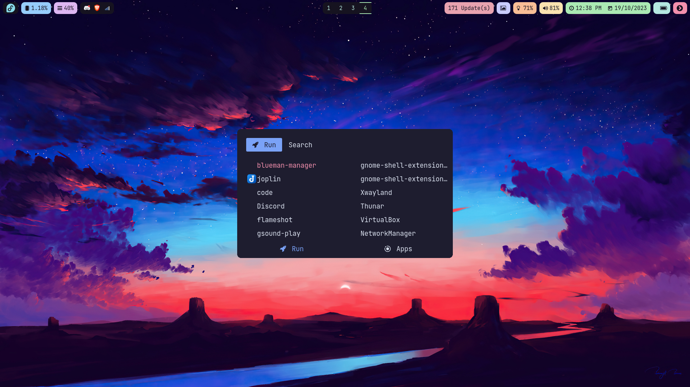

## Dotfiles for my Hyprland Setup

### Installation

Clone the repository and execute the script to create the symlinks pointing to your configs dotfiles.
```bash
git clone git@github.com:SonOfLope/hypr-dot-files.git
cd hypr-dot-files
./create-symlinks.sh
```

### Preview



